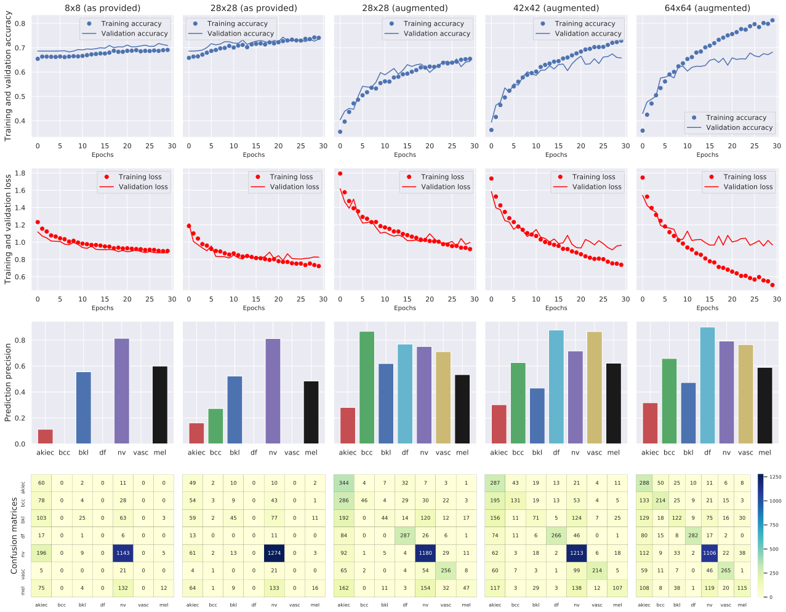

Convolutional neural network based on the skin lesion image data set [HAM10000](https://dataverse.harvard.edu/dataset.xhtml?persistentId=doi:10.7910/DVN/DBW86T). 

Created as part of Project 2 for module COS624 ([Cognitive Systems M.Sc.](https://www.ouc.ac.cy/index.php/en/studies/programs/master/cos)). 

## Results
I trained 5 versions of the ConvNet, using 5 different data sets:

1.   Data set with 8x8 pixel images (as provided in the HAM data set).
2.   Data set with 28x28 images (as provided in the HAM data set).
3.   Data set with 28x28 images, same as above, but with augmented lesion types to 2000 images per category. 
4.   Data set with 42x42 images, that I created, with augmented lesion types to 2000 per category. 
5.   Data set with 64x64 images, that I created, with augmented lesion types to 2000 per category.

The networks were all trained for 30 epochs. The graph below summarises the results. 

 